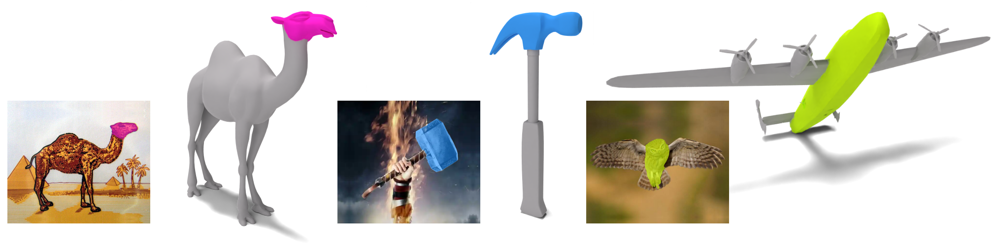

# Best Segmentation Buddies for Image-Shape Correspondence

[Itai Lang](https://itailang.github.io/)<sup style="font-size: 0.7em;">\*</sup>, [Dongwei Lyu](https://scholar.google.com/citations?user=i10yLmIAAAAJ&hl=zh-CN)<sup style="font-size: 0.7em;">\*</sup>, [Dale Decatur](https://ddecatur.github.io/), [Rana Hanocka](https://people.cs.uchicago.edu/~ranahanocka/)
<br> <sup style="font-size: 0.7em;">\*</sup>Equal contribution

<span style="position: relative; display: inline-block;">
  
</span> <br>

<br>
<a href="https://threedle.github.io/bsb/"></a> <a href="https://threedle.github.io/bsb/"></a> <a href="https://arxiv.org/abs/2605.00000"></a>

<br> 

## Abstract
Finding correspondences is a fundamental and extensively researched problem in computer vision and graphics. In this work, we examine the underexplored task of estimating segmentation-to-segmentation correspondence between images in the wild and untextured 3D shapes. This task is highly challenging due to substantial differences in appearance, geometry, and viewpoint. Our approach bridges the cross-modality gap by linking pixels in the image segment to vertices in the corresponding semantic part of the 3D shape.

To achieve this, we first distill deep visual features from a 2D vision model onto the 3D shape surface, allowing for the computation of feature similarity between image pixels and shape vertices. Then, we identify Best Segmentation Buddies, vertices whose most similar image pixel lies within the image segmentation region, enabling the reliable discovery of vertices in semantically corresponding shape parts. Finally, we leverage distilled 3D features from the 2D image segmentation model to segment the shape directly in 3D, bootstrapping the correspondence process. We demonstrate the generality and robustness of our approach across a wide range of image-shape pairs, showcasing accurate and semantically meaningful correspondences.

## Installation
Clone this repository:
```bash
git clone https://github.com/threedle/bsb.git
cd bsb/
```

Create and activate a conda environment:
```bash
conda create -n bsb python=3.9.18 --yes
conda activate bsb
```

Alternatively, you may create the environment locally inside the `bsb` folder and activate it as follows:
```bash
conda create --prefix ./bsb python=3.9.18 --yes
conda activate ./bsb
```

Install the required packages:
```bash
sh ./install_environment.sh
```

Note: the installation assumes a machine with a GPU and CUDA.

## Image Segmentation Model
Download the [ViT-H SAM model](https://dl.fbaipublicfiles.com/segment_anything/sam_vit_h_4b8939.pth) (simply click on the link). Put the downloaded file `sam_vit_h_4b8939.pth` under the folder `./SAM_repo/model_checkpoints/`.

## Demo
This demo shows how to run image-shape correspondence with an image, pre-distilled DINOv2 features, and a pre-trained iSeg model for a `guitar` mesh.

Download the demo data:
```bash
bash download_demo_data.sh
```
* A `guitar_01.png` image will be stored at `./images/guitar_01.png`.

* The `guitar` mesh will be stored at `./meshes/guitar.obj`.

* The pre-distilled DINOv2 vertex features will be stored at `./demo/guitar/encoder_dino/pred_f.pth`. 

* The pre-trained SAM vertex features of the iSeg encoder will be stored at `./demo/guitar/encoder_sam/pred_f.pth`.

* The pre-trained iSeg decoder model will be stored at `./demo/guitar/bsb/decoder_checkpoint.pth`.

If you experience issues with the script, download directly the [image](https://drive.google.com/file/d/1WnWqus0QmAEPO9Ftsja2hSfN963fskmP/view?usp=sharing), [mesh](https://drive.google.com/file/d/1USul1CkApiCEDYbXBnRslhKna_BsQCfw/view?usp=sharing), [DINOv2 vertex features](https://drive.google.com/file/d/1YeZy5rQpsqjsw2ws4R4rdDVjfK9FNyBJ/view?usp=sharing), [SAM vertex features](https://drive.google.com/file/d/108-tioyNq1NwZgiPCN2OfPIbpuV8Y6gf/view?usp=sharing), and [iSeg decoder checkpoint](https://drive.google.com/file/d/16qk2At1dNUsoC0lMfFovsfy1SUgJT2Ia/view?usp=sharing), and store them under the corresponding folders.

Run image-shape correspondence with a pixel click (130, 140) on the guitar's head:
```bash
python image_shape_correspondence.py --mode 'bsb' --img_path ./images/guitar_01.png --object_pixel 130 140 --object_mask_idx 2 --test_pixel 130 140 --test_mask_idx 0 --save_dir ./demo/guitar/bsb/ \
  --obj_path ./meshes/guitar.obj --encoder_dino_f_path ./demo/guitar/encoder_dino/pred_f.pth --encoder_sam_f_path ./demo/guitar/encoder_sam/pred_f.pth --model_name decoder_checkpoint.pth
```

Run image-shape correspondence with a pixel click (270, 370) on the guitar's neck:
```bash
python image_shape_correspondence.py --mode 'bsb' --img_path ./images/guitar_01.png --object_pixel 270 370 --object_mask_idx 2 --test_pixel 270 370 --test_mask_idx 0 --save_dir ./demo/guitar/bsb/ --load_pix_dino_features 1 \
  --obj_path ./meshes/guitar.obj --encoder_dino_f_path ./demo/guitar/encoder_dino/pred_f.pth --encoder_sam_f_path ./demo/guitar/encoder_sam/pred_f.pth --model_name decoder_checkpoint.pth
```

Run image-shape correspondence with a pixel click (700, 750) on the guitar's volume knob:
```bash
python image_shape_correspondence.py --mode 'bsb' --img_path ./images/guitar_01.png --object_pixel 700 750 --object_mask_idx 2 --test_pixel 700 750 --test_mask_idx 0 --save_dir ./demo/guitar/bsb/ --load_pix_dino_features 1 \
  --obj_path ./meshes/guitar.obj --encoder_dino_f_path ./demo/guitar/encoder_dino/pred_f.pth --encoder_sam_f_path ./demo/guitar/encoder_sam/pred_f.pth --model_name decoder_checkpoint.pth
```

For each run, the following resutls with be saved under `./demo/guitar/bsb/`:
* The mask of the object in the image (a `png` file)
* The mask of the object's part in the image (a `png` file)
* The mesh colored according to the corresponding segmented 3D part (a `ply` file)
* Rendered views of the colored mesh and the best segmentaion buddy (BSB) vertex point (a `png` file)
* If the clicked pixel has a BSB vertex, the part mask for the nearest neighbor pixel of the BSB vertex will also be saved (as in the guitar's head and neck cases).
* If the clicked pixel does not have a BSB vertex (as in the guitar's volume knob case), such a mask will not be saved and the mesh segmentation will be empty by default. You may optionally visualize the segmentation in this case by adding the argument `--compute_seg_for_non_bsb 1` to the command above.

Note:
You can segment only the image using the following command:
```bash
python image_shape_correspondence.py --mode 'image_seg' --img_path ./images/guitar_01.png --test_pixel 700 750 --test_mask_idx 0 --save_dir ./demo/guitar/bsb
```

For removing the pixel click visualization on the image, add the argument `--show_test_click 0`.

## Training Instructions
This section explains how to generate data, distill DINOv2 for a 3D shape and train an `iSeg` segmentation model. These items will be exemplified for the `guitar` mesh.

Generate random views of the 3D shape:
```bash
python encoder.py --obj_path ./meshes/guitar.obj --name guitar --encoder_data_dir ./data/guitar/encoder_data --generate_random_views 1 --encode_random_views 0 --start_training 0 --test 0
```

The random views will be saved to `./data/guitar/encoder_data/`. 

Generate training data and train the DINOv2 encoder for the shape:
```bash
python encoder.py --obj_path ./meshes/guitar.obj --name guitar --encoder_data_dir ./data/guitar/encoder_data --encoder_model_dir ./experiments/guitar/encoder_dino \
  --model_type dino --width 1024 --n_classes 1024 --generate_random_views 0 --encode_random_views 1 --start_training 1
```

The predicted DINOv2 encoder features per mesh vertex will be saved to `./experiments/guitar/encoder_dino/pred_f.pth`. These features are used for computing similarity between shape vertices and image pixels.

Generate training data and train the iSeg encoder for the shape:
```bash
python encoder.py --obj_path ./meshes/guitar.obj --name guitar --encoder_data_dir ./data/guitar/encoder_data --encoder_model_dir ./experiments/guitar/encoder_sam \
  --model_type dino --width 256 --n_classes 256 --generate_random_views 0 --encode_random_views 1 --start_training 1
```

The predicted iSeg encoder features per mesh vertex will be saved to `./experiments/guitar/encoder_sam/pred_f.pth`. These features are used during the iSeg decoder training.

Generate data for training the iSeg decoder (a single click):
```bash
python data_generation.py --name guitar --obj_path ./meshes/guitar.obj --decoder_data_dir ./data/guitar/decoder_data --single_click 1 --second_positive 0 --second_negative 0
```

The data will be saved to `./data/guitar/decoder_data/`.

Train the iSeg decoder:
```bash
python image_shape_correspondence.py --mode train_shape_decoder --obj_path ./meshes/guitar.obj --encoder_f_path ./experiments/guitar/encoder_sam/pred_f.pth --decoder_data_dir ./data/guitar/decoder_data --save_dir ./experiments/guitar/bsb/ --model_name decoder_checkpoint.pth --mode train --num_epochs 5 --use_positive_click 0 --use_negative_click 0
```

The decoder model will be saved to `./experiments/guitar/decoder/decoder_checkpoint.pth`. This decoder is used for computing 3D shape segmentation for a corrsponding BSB vertex for a pixel click on an image.

To run image-shape correspondence with the distilled DINOv2 vertex features and the trained iSeg model, see the instructions in the [Demo](#demo) section.

## Citation
If you find our work useful for your research, please consider citing:
```
@InProceedings{lang2026bsb,
  author    = {Lang, Itai and Lyu, Dongwei and Decatur, Dale and Hanocka, Rana},
  title     = {{Best Segmentation Buddies for Image-Shape Correspondence}},
  booktitle = {Proceedings of the IEEE/CVF Conference on Computer Vision and Pattern Recognition (CVPR)},
  month     = {June},
  year      = {2026}
}
```
